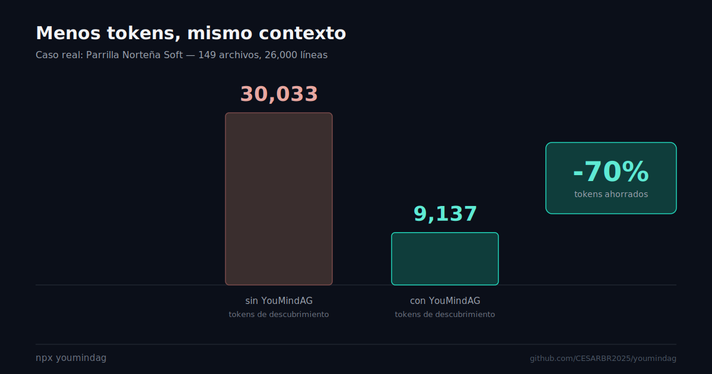

<p align="center">
  
  
  
  
  
</p>

<h1 align="center">🧠 YouMindAG</h1>

<p align="center">
  <strong>Tu agente entiende tu proyecto desde el primer mensaje.</strong><br>
  Una línea inyecta arquitectura, dependencias, reglas y esquema de BD a Claude Code, Cursor, opencode y Copilot.
</p>

<p align="center">
  <code>npx youmindag</code>
</p>

<p align="center">
  <a href="#-instalación">Instalación</a> ·
  <a href="#-el-caso-real">El caso real</a> ·
  <a href="#-cómo-funciona">Cómo funciona</a> ·
  <a href="#-compatibilidad">Compatibilidad</a> ·
  <a href="#-la-historia-de-los-46-bugs">La historia</a>
</p>

<!--
  TODO: reemplazar este bloque por el asciinema/vhs real una vez grabado.
  Formato asciinema: [](https://asciinema.org/a/XXXXX)
  Formato vhs (gif): <p align="center"></p>
-->
<p align="center">
  <em>🎥 Demo en terminal — próximamente</em>
</p>

---

## 📊 El caso real

No usamos las cifras de npm ("+2,000 instalaciones") porque probablemente están infladas por bots de seguridad que escanean cada versión publicada, no por uso real. En vez de eso, esto es un caso medido en un proyecto real:

<p align="center">
  
</p>

<p align="center">

| Proyecto | Archivos | Líneas | Tokens antes | Tokens después | Ahorro |
|---|---|---|---|---|---|
| Parrilla Norteña Soft | 149 | 26,000 | 30,033 | 9,137 | **~70%** |

</p>

Esa diferencia es lo que el agente ya no tiene que "descubrir a mano" leyendo archivo por archivo antes de poder trabajar en una tarea.

## 🎯 El problema

Cuando trabajas con AI coding tools (opencode, Claude Code, Cursor, etc.) en proyectos reales, el agente:

- ❌ **No sabe** la estructura del proyecto
- ❌ **Gasta tokens** buscando archivos que debería conocer
- ❌ **No conoce** las reglas de arquitectura
- ❌ **Ignora** dependencias entre módulos

## ✅ La solución

YouMindAG inyecta un **sistema de contexto completo** en tu proyecto en 30 segundos:

| Componente | Qué resuelve |
|-----------|-------------|
| `boveda/` | Documentación estructurada (Obsidian-ready) |
| `.opencode/` | Plugin que auto-carga contexto según la tarea |
| `scripts/` | Analizador de tareas, extractor de BD |
| `AGENTS.md` | Reglas + prohibiciones + checklist |
| Graphify | Grafo de dependencias del proyecto |

## 🚀 Instalación

```bash
cd /ruta/a/mi-proyecto
npx youmindag
```

Listo. Abre un chat con tu AI coding tool y escribe cualquier tarea.

**Lo que NO modifica:**

- ❌ No toca tu código fuente
- ❌ No modifica archivos existentes (solo agrega nuevos)
- ❌ No instala dependencias adicionales (excepto `@sentropic/graphify`)
- ❌ No rompe el build

## 🔄 Cómo funciona

```
Tú escribes: "agrega campo teléfono al módulo X"
  ↓
Plugin detecta "módulo X" → ejecuta load-context.mjs
  ↓
Se muestra: docs + source + graph deps + troubleshooting
  ↓
El agente ya sabe qué archivos leer
  ↓
Implementa siguiendo las reglas de arquitectura
  ↓
npx tsc --noEmit + npm run build + npx graphify update
```

## 🤖 Compatibilidad

| Herramienta | Soporte |
|-------------|---------|
| opencode | ✅ Plugin nativo |
| Claude Code | ✅ Lee AGENTS.md + bóveda |
| Cursor | ✅ Vía rules |
| GitHub Copilot | ✅ Vía AGENTS.md |

<details>
<summary><strong>🏛️ Ver la estructura completa que se inyecta</strong></summary>

```
mi-proyecto/
├── boveda/                     ← Bóveda de conocimiento (auto-poblada)
│   ├── Home.md
│   ├── 🏗 Arquitectura/
│   ├── 🧩 Features/
│   ├── 🛠 Stack/
│   ├── 📦 Datos/
│   ├── 🗺 Roadmap/
│   ├── 📡 API/
│   └── 📚 Referencias/
├── .opencode/                  ← Contexto para AI tools
│   ├── plugins/context-loader.js
│   ├── skills/context-loader.yaml
│   └── context-map.yaml
├── scripts/
│   ├── load-context.mjs
│   ├── extract-domain.mjs
│   ├── export-schema.mjs
│   ├── populate-vault.mjs        ← Repoblar bóveda manualmente
│   ├── ym-dev.mjs                ← Wrapper del dev server (logs automáticos)
│   ├── trace-utils.mjs           ← Utilidades compartidas de trace
│   ├── trace-components.mjs      ← Lifecycle tracker para componentes React
│   ├── trace-server.mjs          ← Tracer para server actions
│   ├── trace-client.mjs          ← Hook shadowing para componentes cliente
│   └── session-checkpoint.mjs    ← Recuperación de sesión
├── AGENTS.md                   ← Reglas + checklist
└── .graphify/                  ← Grafo de conocimiento
```

</details>

<details>
<summary><strong>🔧 Ver todos los comandos CLI</strong></summary>

| Comando | Propósito |
|---------|-----------|
| `youmindag` | Instalar o actualizar el proyecto |
| `youmindag db "SELECT ..."` | Ejecutar query SQL contra la BD (tabla ASCII) |
| `youmindag db` | Modo interactivo REPL de BD |
| `youmindag dev --status` | Ver estado del servidor de desarrollo |
| `youmindag dev --restart` | Reiniciar el servidor de desarrollo |
| `youmindag dev --logs` | Ver logs del servidor de desarrollo |
| `youmindag dev --wrap` | Envolver dev script para capturar logs automáticos |
| `youmindag dev --unwrap` | Restaurar dev script original |
| `youmindag trace --client "Comp"` | Rastrear hooks (useEffect/useState) en componente cliente |
| `youmindag trace --components "A,B"` | Inyectar lifecycle tracker en componentes React |
| `youmindag trace --server "fn1,fn2"` | Inyectar tracer en funciones server-side |
| `youmindag trace --undo` | Restaurar todos los archivos originales |
| `youmindag trace --force` | Ignorar advertencia de cambios sin commit |
| `youmindag references <simbolo>` | Buscar referencias de un símbolo en el código |
| `youmindag context --load <modulo>` | Cargar contexto de un módulo |
| `youmindag status` | Verificar estado de la bóveda |
| `youmindag help` | Mostrar esta ayuda |

**Post-instalación:**

| Comando | Propósito |
|---------|-----------|
| `npx graphify query "pregunta"` | Consultar el grafo de dependencias |
| `npx graphify update` | Reconstruir el grafo después de cambios |
| `npm run db:schema` | Actualizar esquema BD desde information_schema |
| `node scripts/populate-vault.mjs` | Repoblar la bóveda manualmente |
| `skill context-loader` | Cargar instrucciones detalladas de contexto |

</details>

<details>
<summary><strong>🏆 Ver cómo se garantiza la calidad de la bóveda (dos capas)</strong></summary>

### Capa 1 — Poblado factual durante install (10/10 siempre)

Al ejecutar `npx youmindag`, se detectan datos duros del proyecto:

| Sección | Fuente | Calidad |
|---------|--------|---------|
| `🛠 Stack/Comandos.md` | `package.json` scripts | ✅ 10/10 |
| `🛠 Stack/Librerias.md` | `package.json` dependencias | ✅ 10/10 |
| `🛠 Stack/Variables de Entorno.md` | `.env` / `.env.example` | ✅ 10/10 |
| `🏗 Arquitectura/Estructura.md` | Árbol de directorios | ✅ 10/10 |
| `📡 API/API Routes.md` | Route files + métodos HTTP | ✅ 10/10 |
| `📡 API/Server Actions.md` | Archivos con `"use server"` | ✅ 10/10 |
| `🏗 Arquitectura/Middleware y Auth.md` | middleware.ts + librerías | ✅ 10/10 |
| `🧩 Features/Index.md` | Módulos detectados | ✅ 10/10 |

### Capa 2 — Poblado por AI al primer chat (10/10 con modelos recomendados)

Cuando abres un chat, el agente lee `AGENTS.md` y completa automáticamente: ADRs de arquitectura, análisis de auth, docs por módulo, convenciones inferidas del código, esquema de BD, docs de endpoints/acciones, changelog desde `git log`, TODOs pendientes, troubleshooting y glosario del dominio.

### Re-poblado manual

```bash
node scripts/populate-vault.mjs
```

</details>

<details>
<summary><strong>🤖 Ver modelos recomendados</strong></summary>

| Modelo | Calidad | Notas |
|--------|---------|-------|
| **Claude Sonnet 4** | ⭐ 10/10 | Mejor seguimiento de instrucciones AGENTS.md |
| **DeepSeek V4** | ⭐ 10/10 | Razonamiento profundo para análisis de arquitectura |
| **GPT-4o / GPT-4.1** | ⭐ 9/10 | Excelente para detección de patrones |
| **Gemini 2.5 Pro** | ⭐ 9/10 | Muy bueno para extracción de vocabulario |
| Otros (Llama 4, Mistral, etc.) | ⭐ 7-8/10 | Funcional, menos preciso |

> La Capa 1 (poblado factual) es 10/10 con cualquier modelo o incluso sin AI.

</details>

## 📖 La historia de los 46 bugs

v2.9.0 modularizó los comandos (`db`, `dev`, `trace`, `watch`, `sync`) y dejó 46 imports faltantes repartidos en 7 archivos, invisibles hasta que ESLint los encontró. Corregirlos llevó a instalar un gate de publicación que hace estructuralmente imposible repetir ese error sin saltárselo a propósito.

<!-- TODO: enlazar aquí el artículo largo (dev.to / blog) cuando esté publicado -->
📄 *Artículo completo: próximamente*

## 🛠️ Estado técnico

**v2.9.3** — estable, con `prepublishOnly` corriendo lint + test antes de cada publish.

Pendiente conocido (alcance futuro, no bugs): auto-poblado limitado a proyectos Node/`package.json`, sin fallback si falla la instalación de Graphify, sin tests de casos límite extremos.

## 🤝 Contribuir

Es open source y las contribuciones son bienvenidas. Antes de abrir un PR, lee la [guía de contribución](./CONTRIBUTING.md) — explica la estructura del proyecto, cómo agregar un comando nuevo, y el gate de verificación obligatorio (`npm run verify`).

## 📝 Licencia

MIT — Haz lo que quieras.

---

<p align="center">
  <strong>Una línea. Tu AI entiende tu proyecto.</strong><br>
  <code>npx youmindag</code>
</p>
