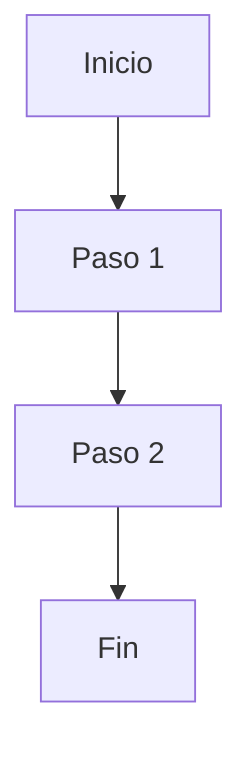

# [Nombre de la Feature]

**Propósito**: Una línea que describe qué hace.

---

## Flujo

## Componentes involucrados

| Archivo | Rol |
|---------|-----|
| `ruta/al/archivo.ts` | Qué hace en esta feature |

## BD

| Tabla | Columnas clave | Uso |
|-------|---------------|-----|
| `nombre_tabla` | `col1`, `col2` | Para qué se usa |

## Reglas de negocio

1. Primera regla
2. Segunda regla
